# 基于非棋盘网格相机标定点自动顺序排序算法

具体算法解析请参阅References博客介绍。适用于绝大部分应用场景，支持畸变无序角点，非均匀分布的角点排序。

# Example 1:

Step1, 人工制造6\*10个投影变换点，并打乱排列顺序

```matlab
pattern = [6,10];% 标定点模式，m*n个点
[X,Y] = meshgrid(1:pattern(2),1:pattern(1));
A = [-2.7379    0.7426         0
    0.2929   -0.7500         0
    0.0100   -0.0500    1.0000];% 手工设定的透视变换矩阵
coordates = [X(:),Y(:),ones(length(X(:)),1)]';
new_coords = A*coordates;
new_coords = new_coords./new_coords(3,:);
 
% 制造打乱顺序的点集，数字表示坐标唯一编号
new_coords = new_coords(1:2,:)';
n = size(new_coords,1);
randidxs = randperm(n);
unorder_pts = new_coords(randidxs,:);

% 无序点集
figure('Units', 'Normalized', 'OuterPosition', [0, 0.04, 1, 0.96]);
hold on;
plot(unorder_pts(:,1),unorder_pts(:,2),'r.','MarkerSize',20);
text(unorder_pts(:,1),unorder_pts(:,2),string(1:n));
grid on
title('unordered points')
```


Step2,算法排序

```matlab
%% 默认从"下到上(y递增)，从左到右(x递增)"排序
orderedPts = CalibSort2(unorder_pts,pattern);
```

Step3, 绘制排序好后的点

```matlab
figure('Units', 'Normalized', 'OuterPosition', [0, 0.04, 1, 0.96]);
hold on;
plot(orderedPts(:,1),orderedPts(:,2),'b.-',MarkerSize=20)
text(orderedPts(:,1),orderedPts(:,2),string(1:prod(pattern)))
grid
title('ordered points')     
```


上述排序好的蓝色点默认是"x递增,y递增"排序的，即"从左到右，从下到上"的排序，如果想要得到”从左到右，从上到下“的排序，**仅对输出的第2个参数**[**index**](./CalibSort2.m)**操作即可，尽量不要对源代码函数"CalibSort2.m"内部实现进行修改。**


比如仍然对上述点排序，要求"从左到右，从上到下":

```matlab
[~,index] = CalibSort2(unorder_pts,pattern);% 只要对输出的第二个参数index操作即可

%% 从"上到下(y减小)，从左到右(x增大)"
index_up2down = reshape(index,[pattern(2),pattern(1)]); % 内存连续
index_up2down = fliplr(index_up2down);
orderedPts = unorder_pts(index_up2down(:),:);

%% 绘图
figure('Units', 'Normalized', 'OuterPosition', [0, 0.04, 1, 0.96]);
hold on;
plot(orderedPts(:,1),orderedPts(:,2),'b.-',MarkerSize=20)
text(orderedPts(:,1),orderedPts(:,2),string(1:prod(pattern)))
grid
title('ordered points') 
```


# Example2

对实际有畸变的图像无序格点排序：

```matlab
imds = imageDatastore("data/gopro*.jpg");
load data/gridPointsData.mat
pattern = [6,9]; % 6 rows,9 cols grid points

randIdxs = randperm(prod(pattern));
for idx = 1:length(imds.Files)
    img = readimage(imds,idx);
    figure('Units', 'Normalized', 'OuterPosition', [0, 0.04, 1, 0.96]);
    tiledlayout(1,2,"TileSpacing","none","Padding","tight")
    nexttile;
    imshow(img);
    hold on;

    unorder_pts = [imagePoints(randIdxs,1,idx),imagePoints(randIdxs,2,idx)];
    plot(unorder_pts(:,1),unorder_pts(:,2),'r.',MarkerSize=20);
    text(unorder_pts(:,1),unorder_pts(:,2),string(1:prod(pattern)));
    title("unordered points")

    % 格点排序
    orderedPts = CalibSort2(unorder_pts,pattern);

    nexttile;
    imshow(img);
    hold on;
    plot(orderedPts(:,1),orderedPts(:,2),'b.-',MarkerSize=20);
    text(orderedPts(:,1),orderedPts(:,2),string(1:prod(pattern)));
    title("ordered points")
end
```

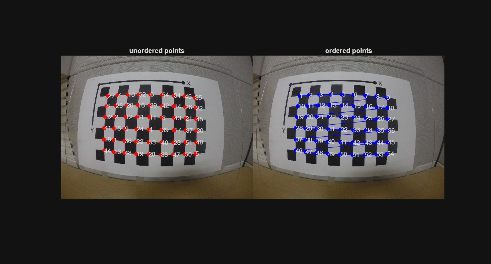

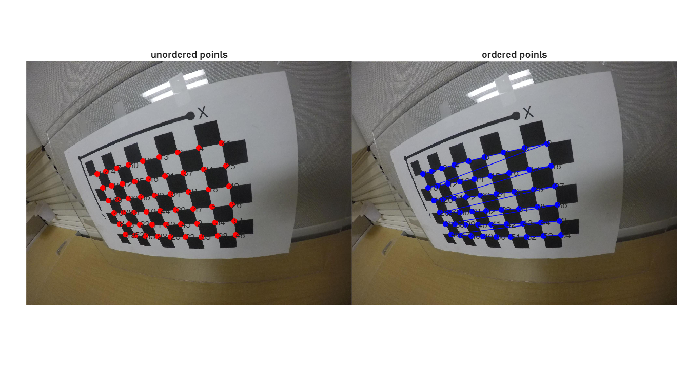

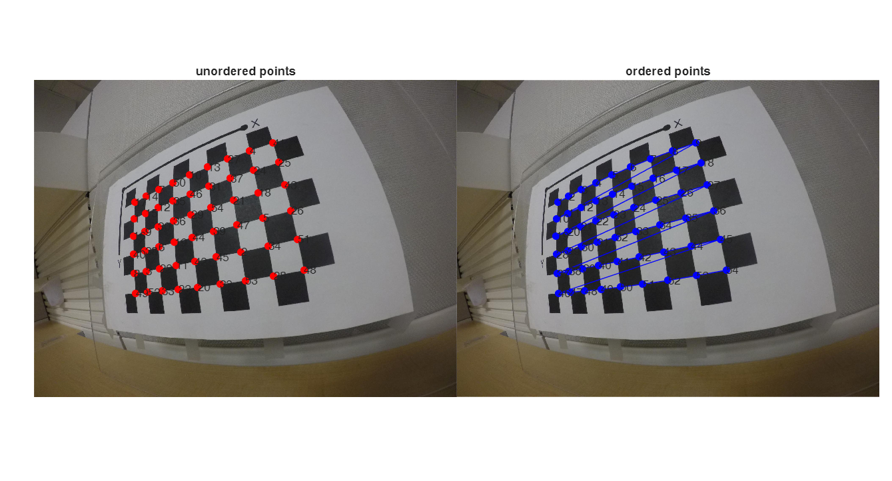

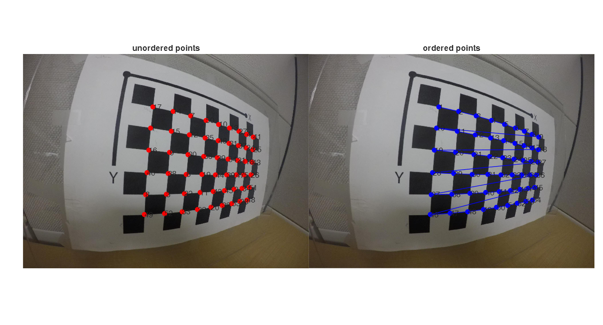

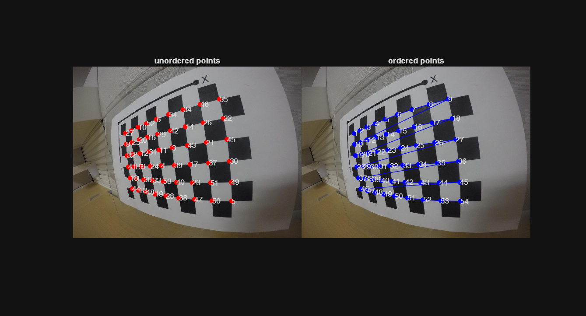

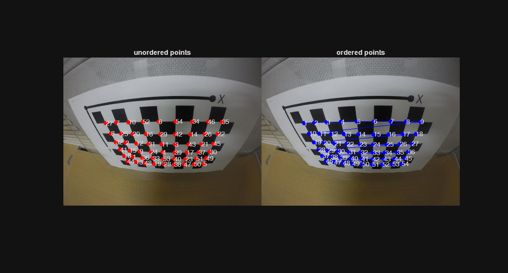

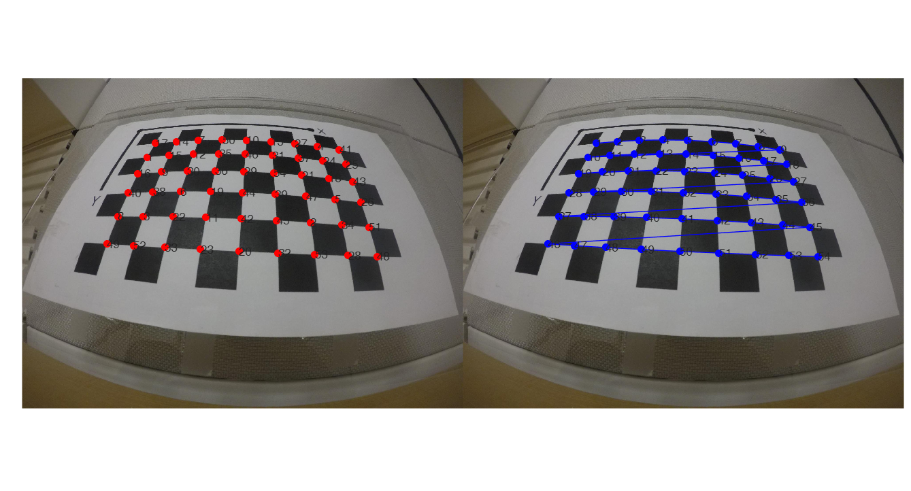

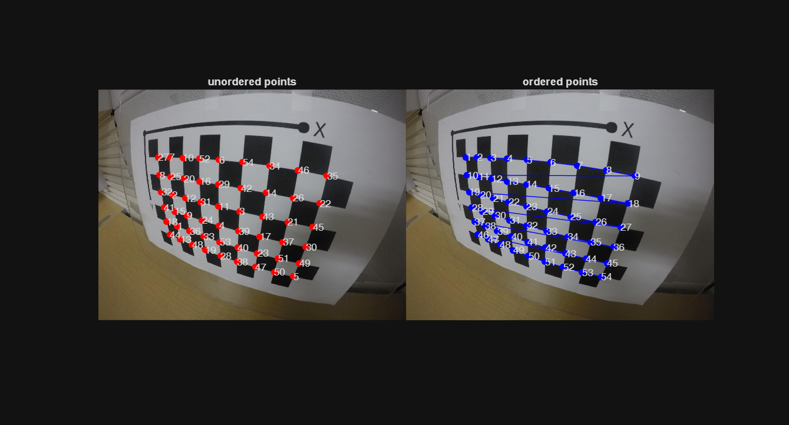

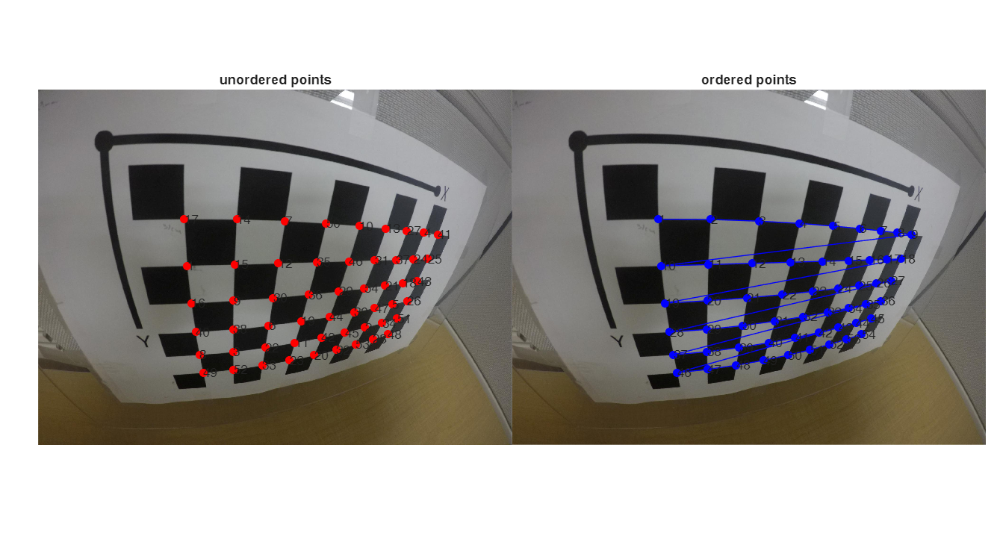

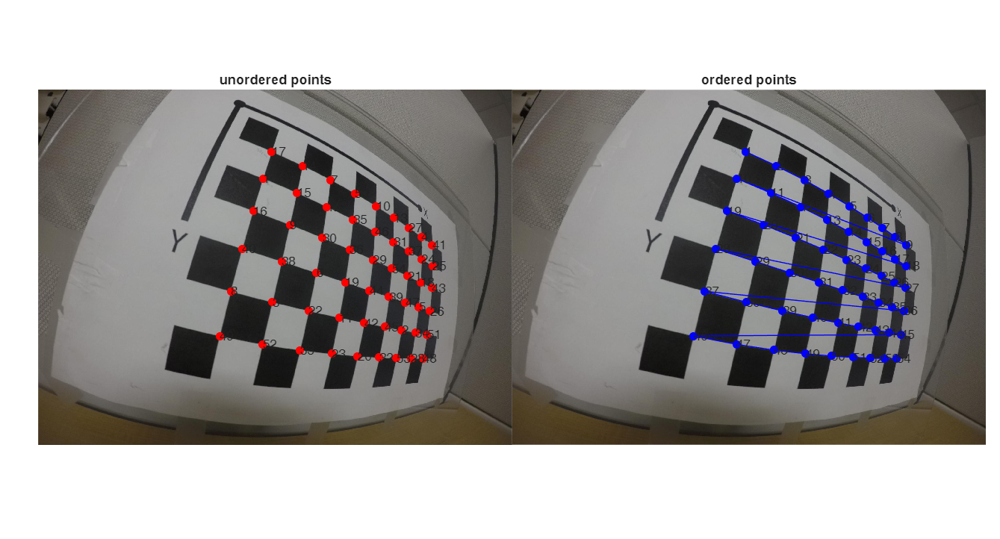

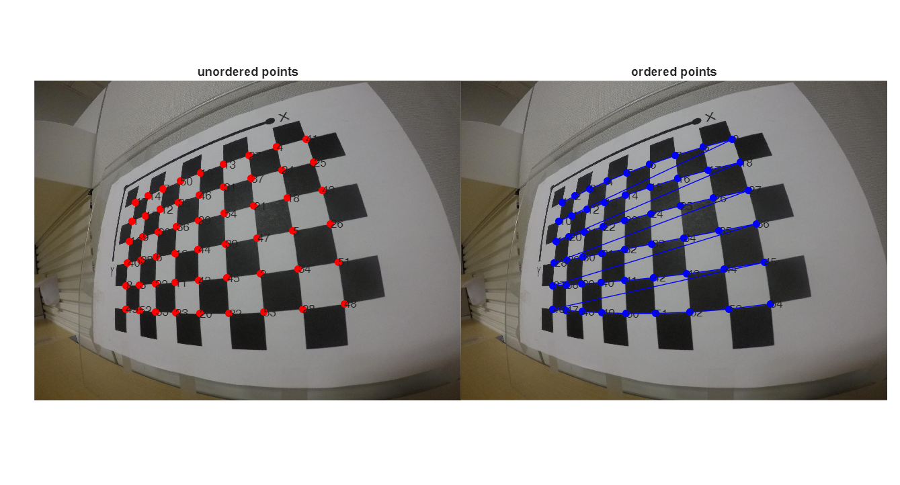
# Example3

对April Grid网格角点排序：

```matlab
aprilGridImg1 = imread("data/leftAprilGrid.jpg");
aprilGridImg2 = imread("data/rightAprilGrid.jpg");
imgs = {aprilGridImg1,aprilGridImg2};
load data/AprilGridPointsData.mat

pattern = [12,12]; % 12 rows,12 cols grid points
randIdxs = randperm(prod(pattern));

for idx = 1:length(imgs)
    img = imgs{idx};
    figure('Units', 'Normalized', 'OuterPosition', [0, 0.04, 1, 0.96]);
    tiledlayout(1,2,"TileSpacing","none","Padding","tight")
    nexttile;
    imshow(img);
    hold on;

    unorder_pts = [imagePoints(randIdxs,1,idx),imagePoints(randIdxs,2,idx)];
    plot(unorder_pts(:,1),unorder_pts(:,2),'r.',MarkerSize=20);
    text(unorder_pts(:,1),unorder_pts(:,2),string(1:prod(pattern)));
    title("unordered points")

    % 格点排序
    orderedPts = CalibSort2(unorder_pts,pattern);

    nexttile;
    imshow(img);
    hold on;
    plot(orderedPts(:,1),orderedPts(:,2),'b.-',MarkerSize=20);
    text(orderedPts(:,1),orderedPts(:,2),string(1:prod(pattern)));
    title("ordered points")
end
```

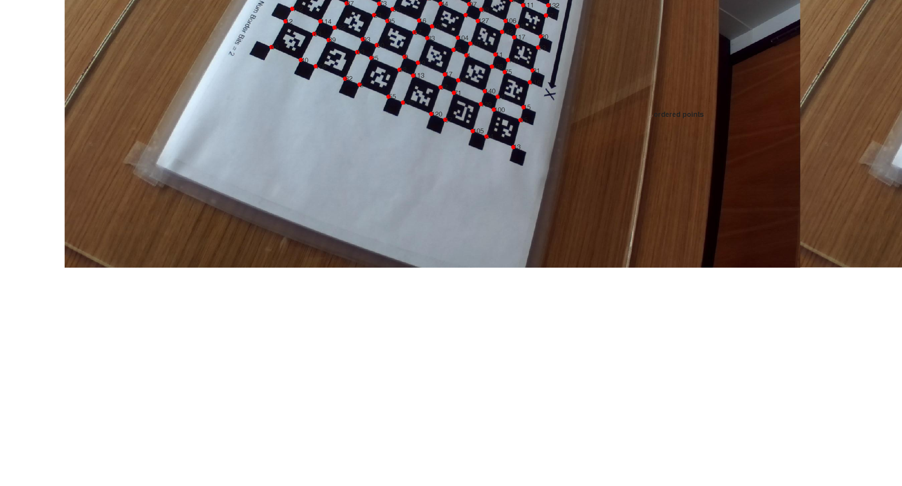

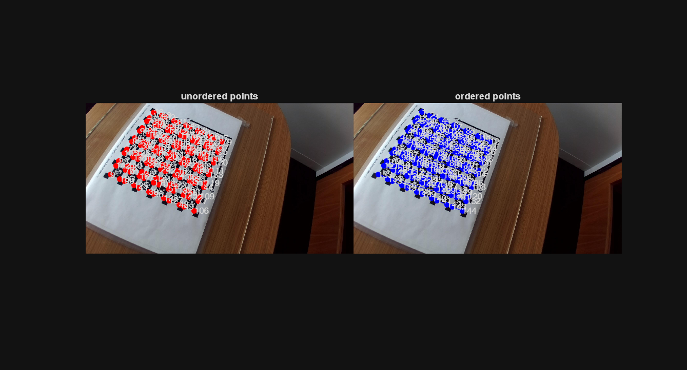

# References

[基于非棋盘网格相机标定点自动顺序排序算法解析](https://blog.csdn.net/cuixing001/article/details/81194145)

