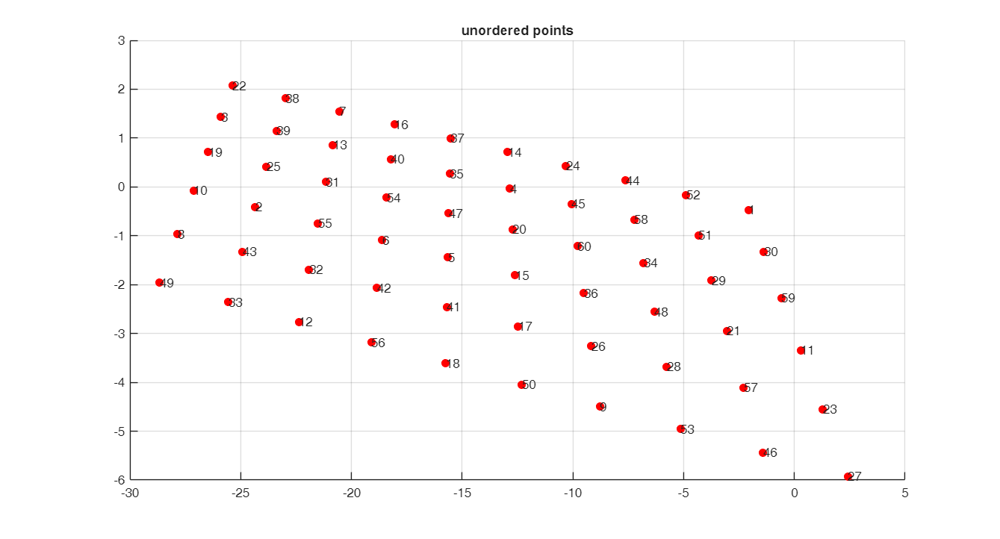

# 基于非棋盘网格相机标定点自动顺序排序算法

具体算法解析请参阅[Reference](#references)博客介绍。

## Example

Step1, 人工制造6\*10个投影变换点，并打乱排列顺序

```matlab
mode = [6,10];% 标定点模式，m*n个点
[X,Y] = meshgrid(1:mode(2),1:mode(1));
T = [-2.7379,0.2929,0.01;
    0.7426,-0.75,-0.05;
    0,0,1.00];% 手工设定的透视变换矩阵
coordates = [X(:),Y(:),ones(length(X(:)),1)];
new_coords = coordates*T;
new_coords = new_coords./new_coords(:,3);
 
% 制造打乱顺序的点集，数字表示坐标唯一编号
n = length(X(:));
index = randperm(n,n);
unorder_pts = new_coords(index,[1,2]);
figure;
hold on;
for i = 1:n
    plot(unorder_pts(i,1),unorder_pts(i,2),'r.','MarkerSize',20);
    text(unorder_pts(i,1)+0.2,unorder_pts(i,2),num2str(i))
end
grid on
title('unordered points')
```



Step2,算法排序

```matlab
%% 默认从"下到上(y递增)，从左到右(x递增)"排序
orderedPts = CalibSort2(unorder_pts,mode);
```

Step3, 绘制排序好后的点

```matlab
figure;
hold on;
plot(orderedPts(:,1),orderedPts(:,2),'b.',MarkerSize=20)
text(orderedPts(:,1),orderedPts(:,2),string(1:prod(mode)))
grid
title('ordered points')     
```


> [!NOTE]
> 上述排序好的蓝色点默认是"x递增,y递增"排序的，即"从左到右，从下到上"的排序，如果想要得到”从左到右，从上到下“的排序，**仅对输出的第2个参数**[**index**](./CalibSort2.m)**操作即可，尽量不要对源代码函数"CalibSort2.m"内部实现进行修改。**

比如仍然对上述点排序，要求"从左到右，从上到下":

```matlab
[~,index] = CalibSort2(unorder_pts,mode);% 只要对输出的第二个参数index操作即可

%% 从"上到下(y减小)，从左到右(x增大)"
index_up2down = reshape(index,[mode(2),mode(1)]); % 内存连续
index_up2down = fliplr(index_up2down);
orderedPts = unorder_pts(index_up2down(:),:);

%% 绘图
figure;
hold on;
plot(orderedPts(:,1),orderedPts(:,2),'b.',MarkerSize=20)
text(orderedPts(:,1),orderedPts(:,2),string(1:prod(mode)))
grid
title('ordered points') 
```


## References

[基于非棋盘网格相机标定点自动顺序排序算法解析\_点集 按照网格点排序分布\-CSDN博客](https://blog.csdn.net/cuixing001/article/details/81194145)
